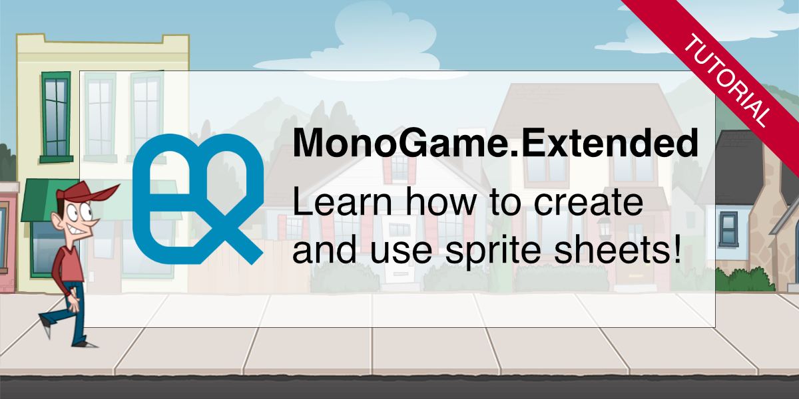

# MonoGame.Extended sprite sheet example

This project demonstrates how to use sprite sheet with [MonoGame.Extended](https://www.monogameextended.net), featuring an animated character walking across a city-themed background.

## Tutorial

This repository is the companion project for our tutorial:

**[How to use sprite sheets with MonoGame.Extended](https://www.codeandweb.com/texturepacker/tutorials/how-to-use-sprite-sheets-with-monogame-extended)**

## Quick Start

1. Install *dotnet*: [https://dotnet.microsoft.com/download](https://dotnet.microsoft.com/download)
2. Clone this repository  
3. Run `dotnet run`

